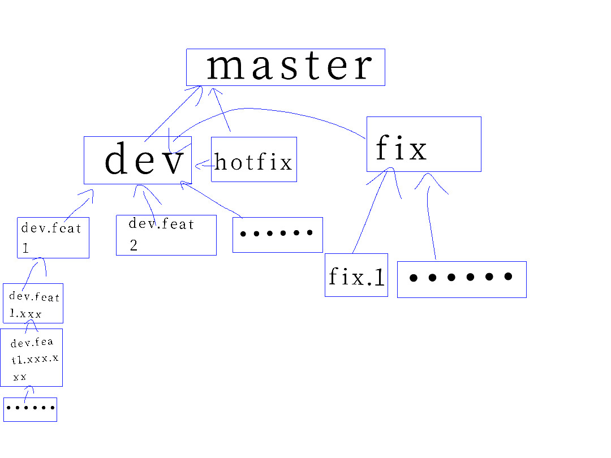

# Contributing to UEL using git

## Table of contents
[TOC]

## Abstract
Before the 2.0.0. Developers are free to use git. That is bad habit. This plan
is for limit this kind habit.

## Branches {#branches}
### Structure of Branches

__Classify for branch. The relationship of the various branches to a tree__



Generate simply tree
```bash
python tools/simply_tree.py
```

!!! note "Example:"
    __Let's took a example for learn it!__
    
    ```console
    - UEL
      |- master
      |  |- dev
      |  |  |- dev.rewrite
    ```
    
    "dev" merge "dev.rewrite", "master" merge "dev"

### Naming for a branch
By __merge process__ to naming most branches is a good idea. It's fast, simple,
and it's simple for to manger.

__Examples__

1. __Development if statement.__
    
    === "Not so good name"
        ```console
        if-statement
        ```
    === "Good name"
        ```
        dev.statements.if-statement
        ```
        
    "if-statement" is too direct. The "dev.statements.if-statement" is good for to merge process
    
2. __Fix a bug.__
    
    ```console
    fix.<issue-number>
    ```

## Commit some code(or docs, config, ...) {#commit}
### Make a commit

```bash
git commit -m "<some-introductions>"
```

## PULL Request {#pr}

1. Make a pull request
2. Waiting developers answer
